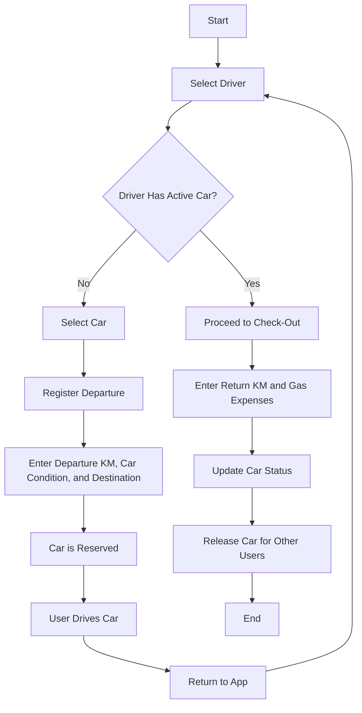

# Struttura del Progetto

## Componenti

- **App**: Componente principale che gestisce lo stato dell'app e le transizioni tra le varie visualizzazioni.
- **SelectDriver**: Componente per selezionare un autista.
- **SelectCar**: Componente per selezionare un'auto disponibile.
- **RegisterDeparture**: Componente per registrare la partenza dell'auto.
- **CheckOut**: Componente per il check-out dell'auto.

## Stato dell'Applicazione

- **selectedDriver**: L'autista attualmente selezionato.
- **activeCar**: L'auto attualmente in uso.
- **departureKM**: Chilometri di partenza.
- **carCondition**: Condizione dell'auto.
- **destination**: Destinazione del viaggio.
- **returnKM**: Chilometri finali.
- **gasExpenses**: Spese di benzina.

