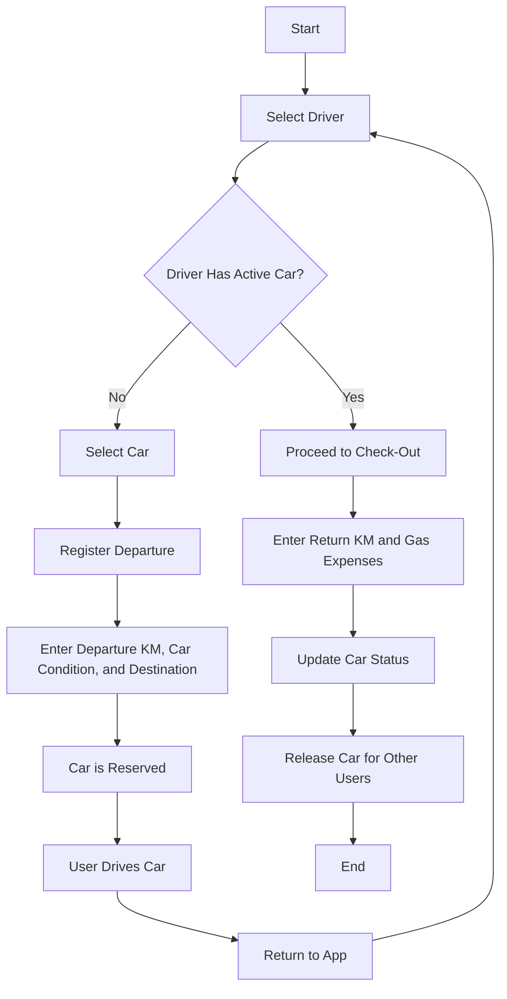

# Struttura del Progetto

## Componenti

- **App**: Componente principale che gestisce lo stato dell'app e le transizioni tra le varie visualizzazioni.
- **SelectDriver**: Componente per selezionare un autista. Se un autista ha già un'auto attiva, permette solo la gestione di quell'auto (check-out).
- **SelectCar**: Componente per selezionare un'auto disponibile. Accessibile solo se l'autista selezionato non ha un'auto attiva.
- **RegisterDeparture**: Componente per registrare la partenza dell'auto selezionata.
- **CheckOut**: Componente per il check-out dell'auto attiva dell'autista.

## Stato dell'Applicazione

- **selectedDriver**: L'autista attualmente selezionato. Contiene informazioni sull'auto attiva, se esistente.
- **activeCar**: L'auto attualmente in uso dall'autista selezionato.
- **departureKM**: Chilometri di partenza registrati.
- **carCondition**: Condizione dell'auto alla partenza.
- **destination**: Destinazione del viaggio.
- **returnKM**: Chilometri finali registrati al ritorno.
- **gasExpenses**: Spese di benzina registrate al ritorno.

## Diagramma di Flusso

